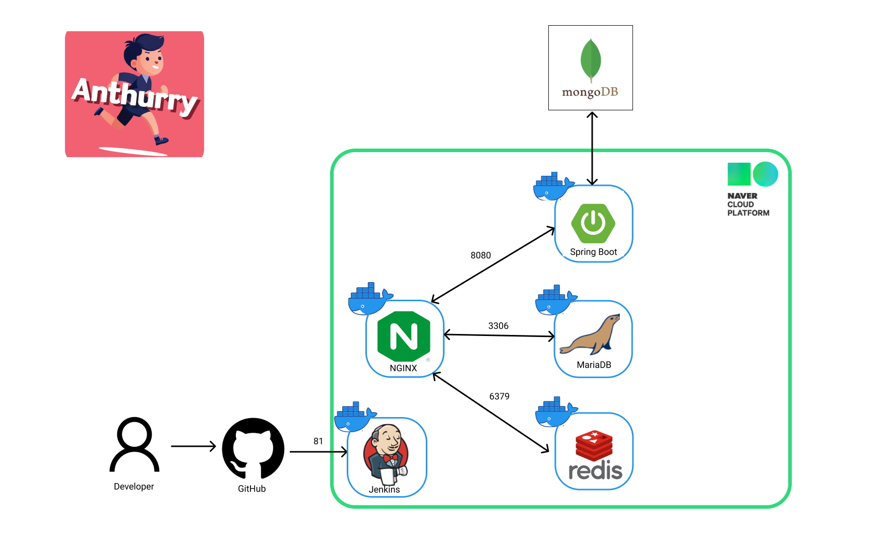
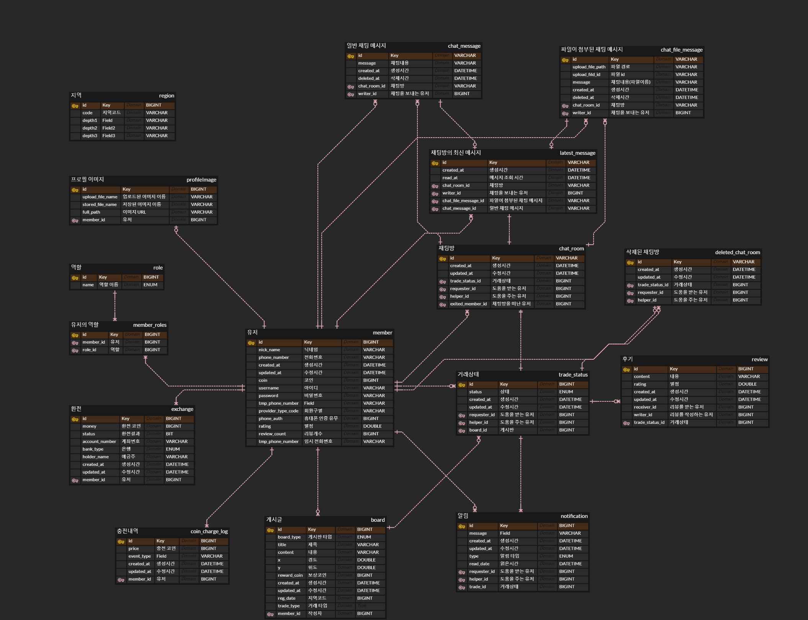

<a name="readme-top"></a>
<div align="center">
  <a href="https://www.anthurry.shop">
    
  </a>

<h3 align="center">Anthurry</h3>

  <p align="center">
    긴급한 일이 발생했을 때 다른 사람들과 온라인 또는 위치 기반으로 도움을 주고 받고, <br>
금전적 보상도 획득할 수 있는 서비스
    <br />
  </p>
</div>

# Anthurry-Project

## 💻 프로젝트 소개

- 급한 일이 있을 때 주변의 도움이 필요한 사람들
- 누군가에게 도움을 줘서 금전적 보상을 받고싶은 사람들
- 채팅을 통해 서로 커뮤니케이션이 가능합니다.
- 상대방의 별점을 통해 신뢰를 확인할 수 있습니다.

## ⌛개발 기간

- 2023.06.19 - 2023.07.13

## 🦁 팀원

| [](https://github.com/Kminwoo97) | [](https://github.com/Hypersand) | [](https://github.com/yurrrrri) | [](https://github.com/udonggi) | [](https://github.com/Min9807) |
|:-------------------------------------------------------------------------------------------------------:|:-------------------------------------------------------------------------------------------------------:|:-----------------------------------------------------------------------------------------------------:|:---------------------------------------------------------------------------------------------------:|:---------------------------------------------------------------------------------------------------:|
|                                   [김민우](https://github.com/Kminwoo97)                                   |                                   [손승완](https://github.com/Hypersand)                                   |                                  [손유리](https://github.com/yurrrrri)                                   |                                  [유동기](https://github.com/udonggi)                                  |                                  [이정민](https://github.com/Min9807)                                  |
|                                            BackEnd Developer                                            |                                            BackEnd Developer                                            |                                           BackEnd Developer                                           |                                          BackEnd Developer                                          |                                          BackEnd Developer                                          |

## ⚙️ 기술


## 🤖 아키텍처


## 🗺️ ERD


## 🎥 [시연 영상](https://youtu.be/428FCZqvAa8)

## 🛫 [서비스 시작하기](https://www.anthurry.shop)

## ✅ 테스트
<div align="center">


</div>
<div align="center">


</div>

# 🚀 시작하기

프로젝트를 로컬 환경에서 성공적으로 실행하기 위해서는 아래의 요구사항들이 필요합니다.

## 📋 요구사항

- **[SpringBoot 3.1.0](https://spring.io/projects/spring-boot)**: 프로젝트의 백엔드를 지원하는 SpringBoot 프레임워크입니다.
- **[JDK 17](https://www.oracle.com/java/technologies/javase-jdk17-downloads.html)**: 프로젝트를 컴파일하고 실행하는 데 필요한 Java Development Kit입니다.
- **[Redis](https://redis.io/download)**: 휴대폰 인증번호 유효기간 관리를 위해 사용하는 Redis입니다.
- **[MariaDB 10.6](https://mariadb.org/download/)**: 프로젝트의 주요 데이터베이스인 MariaDB입니다.
- **[MongoDB](https://www.mongodb.com/ko-kr/atlas/database)**: 채팅 데이터를 저장하고 처리하는 MongoDB입니다.
- **[KakaoLogin](https://developers.kakao.com/)**: 사용자 인증을 위한 카카오 로그인입니다.
- **[NaverLogin](https://developers.naver.com/main/)**: 사용자 인증을 위한 네이버 로그인입니다.
- **[TossPayments](https://developers.tosspayments.com/)**: 코인 충전 서비스를 제공하는 토스페이먼츠입니다.
- **[ObjectStorage](https://www.ncloud.com/product/storage/objectStorage)**: 파일 저장 및 관리를 위한 네이버 오브젝트 스토리지입니다.
- **[NotificationService](https://www.ncloud.com/product/applicationService/sens)**: SMS 알림 서비스를 제공하는 네이버 SENS입니다.

## 🛠️ 시작 가이드

1. 프로젝트 클론
```bash
$ git clone https://github.com/AntHurry/AntHurry.git
$ cd AntHurry
```

2. 설정 파일 작성
```bash
$ cd src/main/resources

application-secret.yml.default 파일에 필요한 정보를 입력합니다.
application-secret.yml.default 파일의 이름을 application-secret.yml로 변경합니다.

추가적으로 자신이 설정한 jasypt 패스워드를 이용해 [암호화](https://www.devglan.com/online-tools/jasypt-online-encryption-decryption)에서 암호화를 진행해주세요.
이후, 암호화된 텍스트를 application.yml에 올바른 위치에 기입해주시기 바랍니다.
```
이제 모든 설정이 완료되었습니다. 애플리케이션을 실행하여 정상적으로 작동하는지 확인합니다.

### 문제가 발생한 경우, 프로젝트의 이슈 트래커를 활용하여 알려주세요. 문제 해결에 최선을 다할 것입니다.
<p align="right">(<a href="#readme-top">맨 위로 이동하기</a>)</p>
